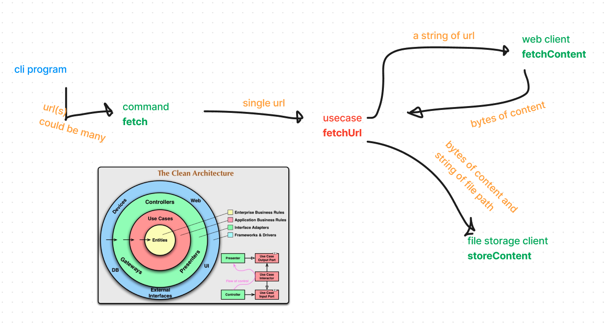

# animated-waffle

## Running the application

By using docker

```
docker build --tag fetch .
```

You need to bind the volume `/app` to see the actual html file. Assuming that the html file will be stored in `result` directory, following command is how you can run the application


```
docker run -v "$(pwd)/result:/app" fetch --help
```

```
docker run -v "$(pwd)/result:/app" fetch https://google.com https://go.dev/doc/manage-install
```

```
docker run -v "$(pwd)/result:/app" fetch --metadata https://google.com https://go.dev/doc/manage-install
```

## Approaching the solution

At a glance, we could know that this is a simple cli application.
I will just jump to the application arcshitecture that follows clean architecture.


